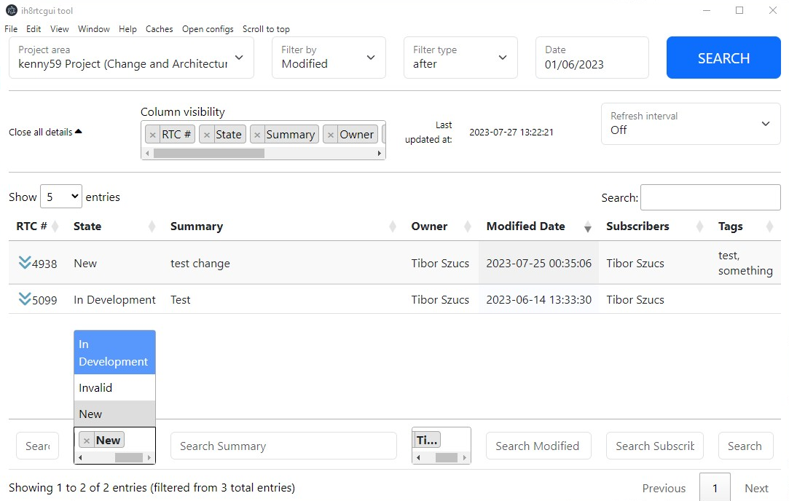

# ih8rtcgui tool

Simple GUI tool for managing RTC items in a more organized manner

## Features
1. Query workitems by modified/created date and further filter in table (can be slow if there are too many workitems)
2. Full-text search in table, dropdowns on columns where it makes sense
3. Modify state and owner of workitem (right click)
4. Add comment with basic formatting (bold, link)
5. Automatic refresh (1 minute, 5 minutes etc)
6. See details of workitem without having to open new page

## Installation
1. Click on "Open configs" and fill details (this is mandatory)
2. Login using your credentials (select save credentials if you don't want to enter it every time)
3. Have fun:)