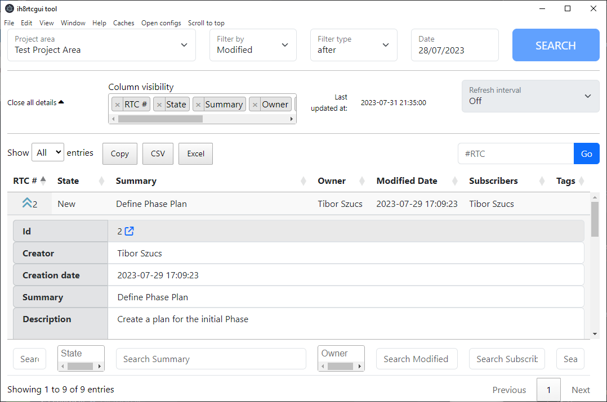
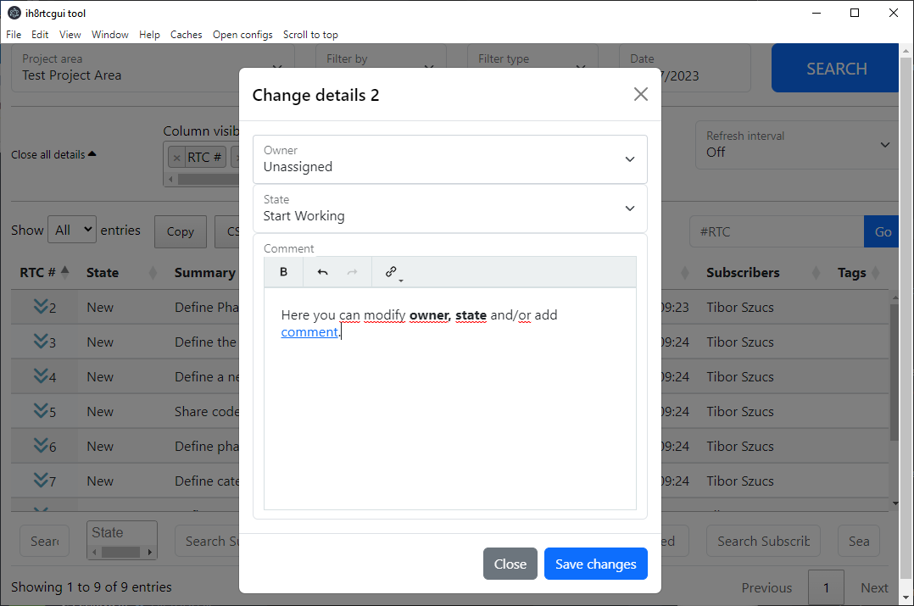

# ih8rtcgui tool

Compatibility: IBM Engineering Lifecycle Management 7.0.2+

Simple GUI tool for managing/keeping track of RTC items in a simplistic manner

Disclaimer: This project is not intended as a full replacement of the original RTC (EWM) web interface, it is more of a way to quickly edit status/owner/add comment to a workitem or check something without having to log in every few hours. (This requires "Save details for automatic re-login?" to be checked on login page)  

## Features
1. Query workitems by modified/created date (before, after, between) and further filter in table (be careful, before can be slow depending on your project area)
2. Jump to workitem by id
3. Full-text search in table, dropdowns on columns where it makes sense
4. Modify state and owner of workitem (right click)
5. Add comment with basic formatting (bold, link)
6. Automatic refresh (1 minute, 5 minutes etc) (it doesn't refresh if there is a workitem opened!)
7. See details of workitem a little quicker than it would in RTC website
8. Auto updater

## Installation
1. Download installer from [Releases](https://github.com/kenny59/ih8rtcgui/releases)
2. Install it (have a coffee/tea/energy drink in the meantime, it may take a few minutes to install), it will automatically open the app after install
3. Click on "Open configs" and fill details (this is mandatory). Click save afterwards
4. Login using your credentials (select save credentials if you don't want to enter it every time)
5. Have fun:)